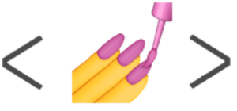

# My Portfolio Website

I made my portfolio website that took me 3 weeks, i learned a lot of **design tips** and a lot of **CSS experience** as i wanted the best final product possible that would represent me.

## Technologies used

 
- react-router
- React Hook Form
  

## Challengues i faced building this website

The mayor challengue i faced was trying to make the website as clean as possible so it was confortable to navigate, while also focusing of making reusable and clean components/code.  
I tried to achieve this by giving it some life by using some smooth animations (Animations explanation below 👇) and some other cool and lightweight stuff.

## Some code details

The form located in the contact section was made using React Hook Form validation system and all this external hook provides.
When submitted the [Form Submit](https://formsubmit.co/?utm_source=formsubmit.co&utm_medium=site%20link&utm_campaign=submission%20page "Form Submit") website handle the message and send it to my e-mail.

---

## About animations

Here i used some external "design" libraries so the website seems more alive.

👉 For the typing animation i used [typed.js](https://github.com/mattboldt/typed.js/ "typed.js")

👉 For the gif i searched into [lottiefiles.com](https://lottiefiles.com/ "Lottie Files") website, where there are a lot of gif to choose.

👉 For the "parallax effect" when hover on each project's box i used [vanilla-tilt](https://micku7zu.github.io/vanilla-tilt.js/ "vanilla-tilt")

👉 Then for the effect of the images appearing on scroll i used [scrollreveal.js](https://scrollrevealjs.org/ "scrollrevealjs")
